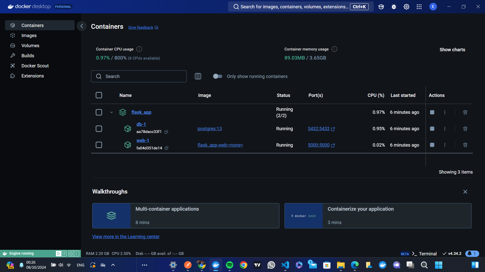
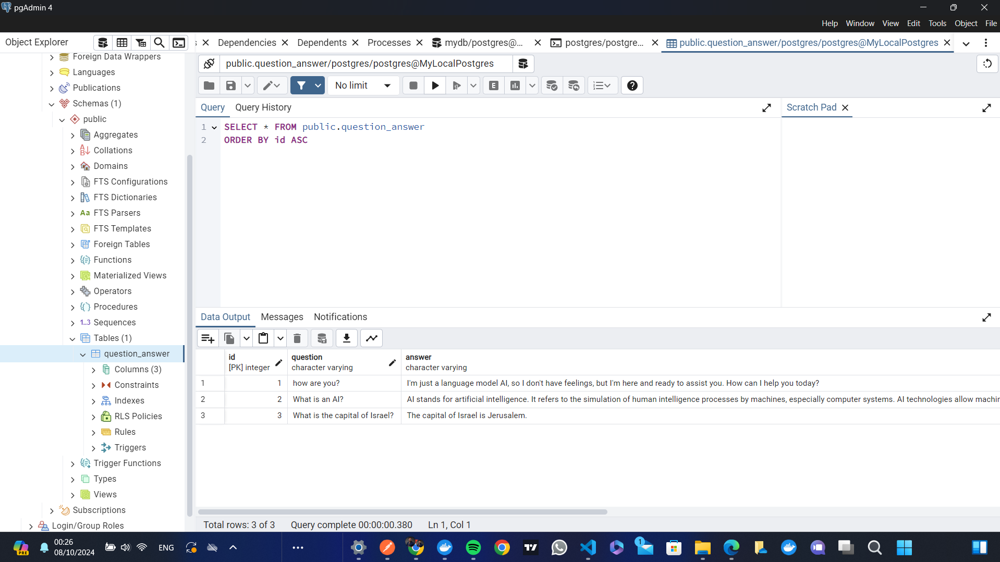
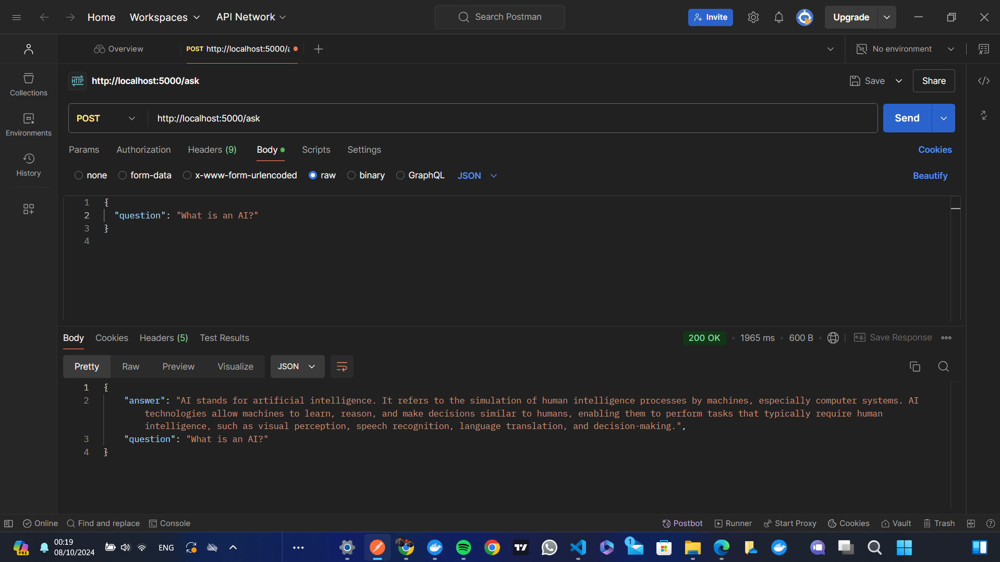
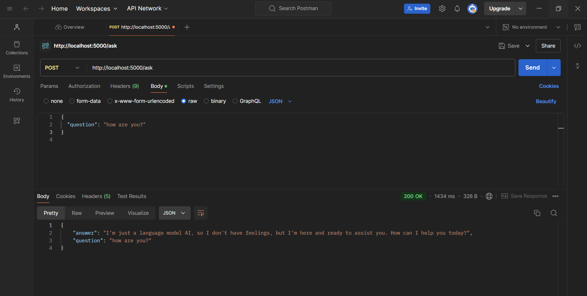
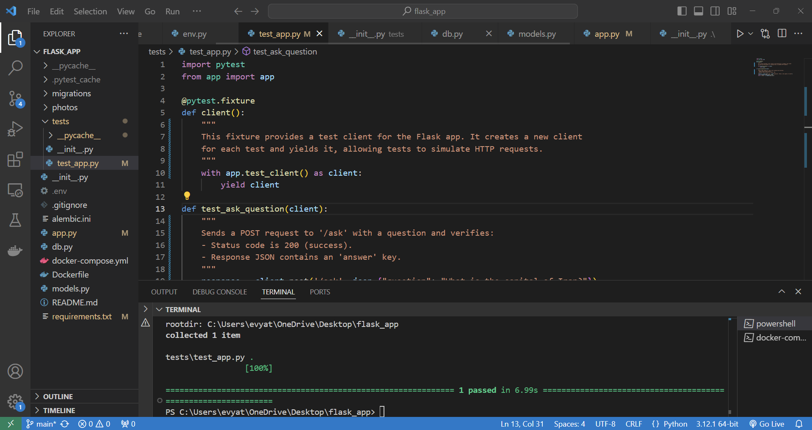

# Flask App

## Overview
<a href="https://www.loom.com/share/96789ed480a040e595c4dffa15b8a13b?sid=9de8c0b6-bc40-40fb-94a1-ab25ed1e16d0">Recorded Video</a>

## Docker Compose

*Configuration of Docker containers for the application.*

## pgAdmin

*User interface for managing PostgreSQL databases.*

## Postman API Requests - Example 1

## Postman API Requests - Example 2

*Example of a POST request to create new data.*

## Test Results

*Output from automated tests to ensure functionality.*
